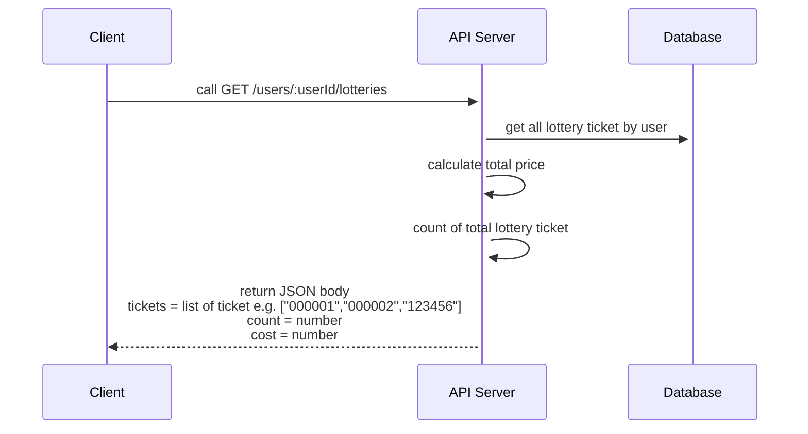

# ระบบย่อยซื้อลอตเตอรี่
แอพพลิเคชั่นธนาคารต้องการเพิ่มฟีเจอร์ให้ผู้ใช้งานสามารถซื้อลอตเตอรี่ได้ เพื่อตอบสนองกลุ่มนักเสี่ยงโชคยุคใหม่ที่ต้องการความสะดวก และไม่ต้องกังวลเรื่องการจัดเก็บลอตเตอรี่ไว้กับตัวเอง รวมทั้งการขึ้นเงินก็สามารถทำผ่านแอพพลิเคชั่นได้อย่างง่ายดาย

## Business Requirements
- แอดมินสามารถเพิ่มข้อมูลลอตเตอรี่เป็นตัวเลข 6 หลักได้
- ผู้ใช้สามารถแสดงรายการลอตเตอรี่ที่มีทั้งหมดได้
- ผู้ใช้สามารถซื้อลอตเตอรี่ได้
- ผู้ใช้สามารถแสดงรายการลอตเตอรี่ที่ตัวเองซื้อได้ พร้อมสรุปราคารวมที่ซื้อทั้งหมดได้
- ผู้ใช้สามารถขายคืนลอตเตอรี่ที่ตัวเองซื้อได้
- ไม่ต้องคำนึงถึงเงินที่ผู้ใช้จะต้องจ่าย ระบบอื่นมีการตรวจสอบอยู่แล้ว UserID ของผู้ใช้เป็นตัวเลข 10 หลักเท่านั้น
- ฟีเจอร์ของแอดมินต้องมีการตรวจสอบสิทธิก่อนถึงจะใช้ได้
- ไม่มีงวดของลอตเตอรี่มาเกี่ยวข้อง

## Prerequisites
* โปรเจคตั้งต้นคือ[โปรเจคนี้] (https://github.com/KBTG-Kampus-ClassNest-SE-Java/assessment)
* กำหนดให้ส่งลิ้งค์คำตอบคือ github repository ที่เก็บโค้ดของคุณ `https://github.com/<your github name>/assessment` ตั้งเป็น public
* *จะต้อง* มีการใช้งาน PostgreSQL
* *จะต้อง* มีการใช้งานสร้าง Table ชื่อ `lottery` เพื่อใช้จัดการกับลอตเตอรี่และ `user_ticket` เพื่อใช้เก็บรายการซื้อขายของผู้ใช้งาน
* *จะต้อง* เปิดใช้งานได้ผ่าน port `8888`
* *จะต้อง* เรียกใช้ Database URL ผ่านทาง Environment variable ชื่อ `DATABASE_URL` ได้


## User Stories
### Story: EXP01
	* As an admin, I want to add a new lottery ticket So that I can have a lottery store
	* ในฐานะผู้ดูแลระบบ ฉันต้องการเพิ่มใบลอตเตอรี่ เพื่อที่จะสร้างคลังเก็บลอตเตอรี่
#### Technical Details: EXP01
* POST /admin/lotteries
* ต้องยืนยันสิทธิ์การเข้าใช้งานด้วย basic authentication (username = admin, password = password)
* Request Body
```json
{
	"ticket": "123456",
	"price": 80,
	"amount": 1
}
```
* Response Body
```json
{
	"ticket": "123456"
}
```


### Story: EXP02
	* As a user, I want a list all lottery ticket So that I can pick what I want to buy
	* ในฐานะผู้ใช้ ฉันต้องการดูรายการลอตเตอรี่ทั้งหมด เพิื่อจะได้เลือกซื้อ
#### Technical Details: EXP02
* GET /lotteries
* Response Body
```json
{
	"tickets": ["000001","000002","123456"]
}
```

### Story: EXP03
	* As a user, I want to buy a lottery ticket So that I can get a change to win
	* ในฐานะผู้ใช้ ฉันต้องการซื้อลอตเตอรี่ เพื่อที่จะได้ลุ้นถูกหวย
#### Technical Details: EXP03
* POST /users/:userId/lotteries/:ticketId
* userId และ ticketId เป็นค่าที่ผู้ใช้ป้อนเข้ามา
* Response Body
```json
{
	"id": "1"
}
```
โดย id มาจาก ID ของตาราง `user_ticket`

### Story: EXP04
	* As a user, I want to list all my lottery ticket So that I can see which one I have already bought and it cost
	* ในฐานะผู้ใช้ ฉันต้องการดูรายการลอตเตอรี่ทั้งหมดที่เคยซื้อ
#### Technical Details: EXP04


### Story: EXP05
	* As a user, I want to sell back my lottery ticket So that I can get my money back
	* ในฐานะผู้ใช้ ฉันต้องการขายคืนลอตเตอรี่เพื่อได้เงินคืน
#### Technical Details: EXP05
* DELETE /users/:userId/lotteries/:ticketId
* userId และ ticketId เป็นค่าที่ผู้ใช้ป้อนเข้ามา
* Response Body
```json
{
	"ticket": "000001",
}
```

## Acceptance Guidelines
* Config Git โดยใช้ชื่อและอีเมล์ที่ถูกตามรูปแบบ
* ทำ Pull request ผ่าน Github
* ระบบสามารถรันและทำงานตาม API ที่กำหนดได้
* ใข้งาน Docker เป็น ทำ Application เป็น Container, ใช้งาน Docker-compose ได้
* กรณี success ต้อง response status code ให้เหมาะสม เช่น
	- 201 StatusCreated
	- 200 StatusOK
* กรณี error ต่างๆ ให้ระบบ response status code ตามความเหมาะสม เช่น
	- 400 StatusBadRequst
	- 500 StatusInternalServerError
* มีการ Validate ข้อมูลที่รับมา เช่น จำนวนตัวอักษรที่รับได้
* มีการป้องกันการใช้งาน API ของแอดมิน
* มีการทำ Containerize ให้ใช้งานผ่าน Docker ได้
* มี Test case เช่น Unit test ครอบคลุมส่วนของโค้ดและคะแนนจะขึ้นอยู่กับ Coverage ของ Test case ด้วย
* โครงสร้างการทำงานถูกต้อง เช่น 
	-	ประกาศตัวแปรถูกต้องไหม
	-	มี Test cases
	-	การเชื่อมต่อระบบ Database
	-	การทำ Transaction ถูกต้องเหมาะสม
* ความสามารถในการบำรุงรักษา เช่น 
	-	การเขียนโค้ดง่ายต่อการอ่านและทำความเข้าใจ
	-	การประมวลผลอยู่ใน Layer ที่เหมาะสม
	-	ไม่มี If ซ้อนกันเยอะๆ
	-	หลีกเลี่ยง Duplicate code ที่มากเกินไป
	-	Method มีโค้ดที่เหมาะสมหรือทำงานสอดคล้องกัน
	-	Method Parameter ที่รับมาต้องไม่มีจำนวนเยอะเกินไป
* ประเภทตัวแปรเหมาะสม ตัวอย่าง เบอร์โทรศัพท์เก็บเป็น String
* ป้องกันการเข้าถึงข้อมูล เช่น ดำเนินการกับข้อมูลได้เฉพาะที่ผู้ใช้นั้นๆ มีสิทธิ์
* มีการจัดการ Clean up โค้ดอย่างเหมาะสม ลบส่วนที่ไม่ต้องการใช้งาน และมีการจัดรูปแบบโค้ด
* การให้คำแนนจะแบ่งให้เป็นส่วน หากทำไม่เสร็จหรือไม่ได้ทำจะได้คะแนนตามส่วน

## สรุปคำถามที่มีคนถามไว้เผื่อมีคนสงสัยแล้วไม่ได้อ่านแชท

1. มี database/design ให้หรือเปล่า?

ตอบ Database สามารถออกแบบได้เลยครับ ให้อย่างน้อยมีตารางชื่อ lottery และ user_ticket โดยถ้าชื่อไม่ตรงสามารถกำหนด @Table(name = "ชื่อตาราง") ไปที่ entity ได้ https://www.baeldung.com/jpa-entity-table-names

2. ตรง User story ในแต่ละข้อที่มี Request / Response มาให้ อันนี้ถือเป็น final design แล้ว ต้องทำตามนี้เท่านั้น (ถ้าแก้ไขปรับเปลี่ยนจะถูกหักคะแนน) หรือสามารถปรับเปลี่ยนได้ตามความเหมาะสมเหรอครับ 

ตอบ Request กับ Response ใช้วิธีเช็คโดยการรันโปรแกรมปกติห้ามขาดแต่เกินได้ (แนะนำว่าทำให้ตรงจะปลอดภัยสุด)

3. เลข lottery ticket 1 เบอร์สามารถมีมากกว่า1ใบได้มั้ยครับ?

ตอบ สามารถมีได้ 1 ใบ หรือหลายใบซ้ำกันก็ได้ การให้คะแนนไม่ได้ตรวจตรงนี้ จะโฟกัสไปที่การตรวจว่าผลลัพธ์ของการคำนวณต้องถูกครับ

4. มีแค่ Admin ที่ต้อง Authen ส่วน User ไม่จำเป็นต้อง Authen (Public endpoint) ใช่ไหมครับ?

ตอบ ใช่ครับ


5. ตัว username กับ password สามารถใช้เป็น Inmemory ได้ไหมครับ หรือ set ค่าใน application.properties ก็ได้ครับ?

ตอบ ถ้าหมายถึงของตัว Authen ได้ทั้งสองแบบครับ

6. EX03: ตัวลอตเตอรี่หากทำตาม requirement พื้นฐานสามารถซื้อได้เพียงครั้งละใบใช่ไหมครับ ถ้าเรียกการซื้อลอตเตอรี่เบอร์เดิมอีกครั้งจะถือว่าซื้อ 2 ครั้ง หรือ ไม่นับซ้ำครั้ง หากเลือกที่ ignore การซื้อซ้ำ สามารถเลือกที่จะ return error แทนการอัพเดทได้ไหม (กำหนดให้ซื้อได้ 1 ใบ ต่อ 1 คน)

ตอบ EX03 ซื้อได้ทีละ 1 ใบครับ ตอนตรวจจะไม่ได้ตรวจว่าเราซื้อซ้ำหรือเปล่า ดังนั้นกรณีทดสอบเราจะทดสอบการซื้อครั้งเดียวในแต่ละตัวเลข ขอแค่การซื้อทำงานได้ถูก

7. EX05: จากข้อที่แล้วถ้ามีการซื้อซ้ำ การที่จะขายคืนล็อตเตอรี่ผมจะต้องขายคืนลอตเตอรี่ชุดใดบ้าง ถ้าเป็นกรณีที่ซื้อซ้ำได้ผมต้องขายคืนรายการล่าสุดหรือทั้งหมดของเลขนั้นครับ

ตอบ EX05 การขายจะขายเพียงครั้งเดียว ดังนั้นถ้าเราทำ support ลอตเตอรี่หลายใบ ควรต้องลบทุกใบออกครับ ตัวนี้จะตรวจสอบแค่ว่ามีการลบออกจริงไหมในระบบ

8. ผมเปลี่ยนชื่อไฟล์ที่เป็น project ตั้งต้นบางอันได้ไหมนะครับพอดีมันแดงใน intelij เลยอยากแก้ ><

ตอบ ได้เลยครับ รันขึ้นก็พอ 🤣

9. spring.datasource.username กับ spring.datasource.password ตั้งเป็น username กับ password เลยได้ไหมครับ 
ไม่ต้องทำเป็น env variable เหมือน datasource.url ใช่ไหมครับ

ตอบ หมายถึงตรง config connection ของ database ใช่ไหมครับ ใช้เป็นอะไรก็ได้ ขอให้เชื่อมต่อได้ก็พอครับ
